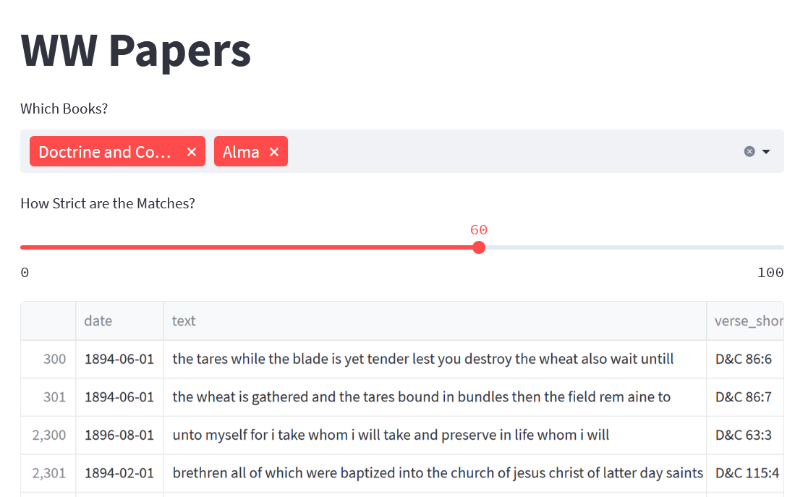
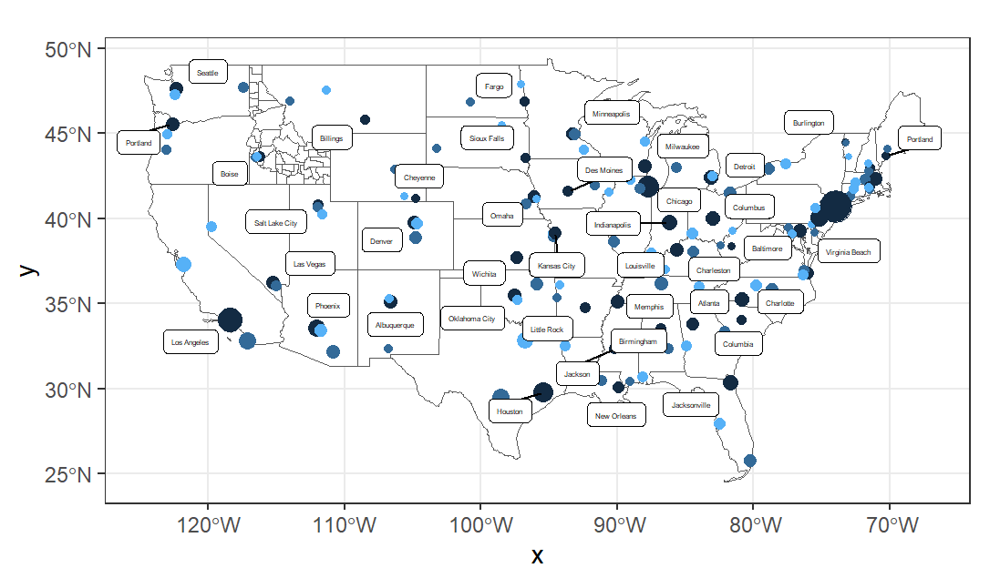
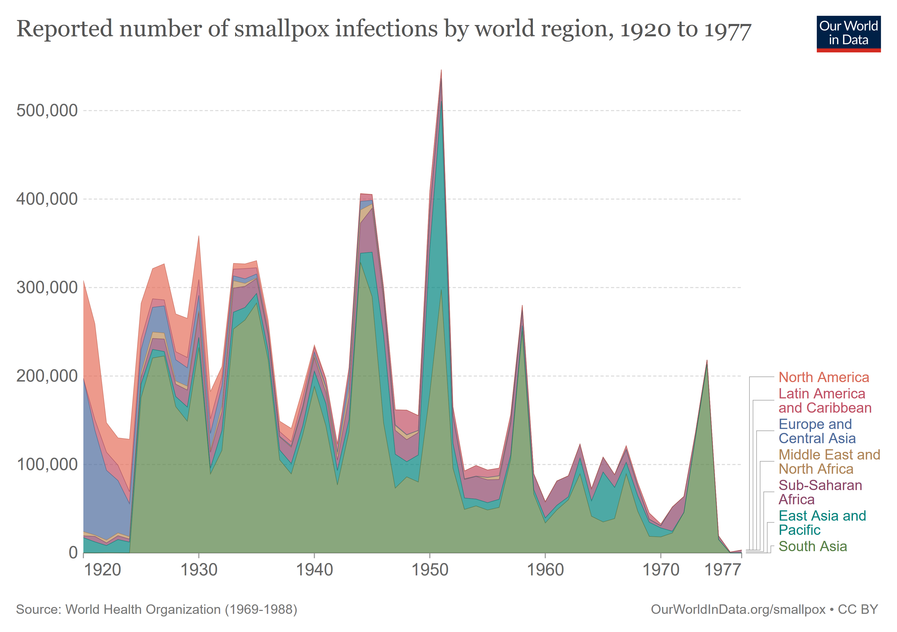
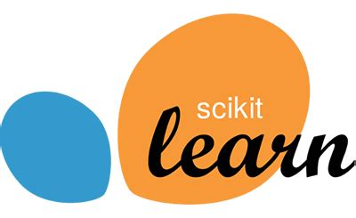
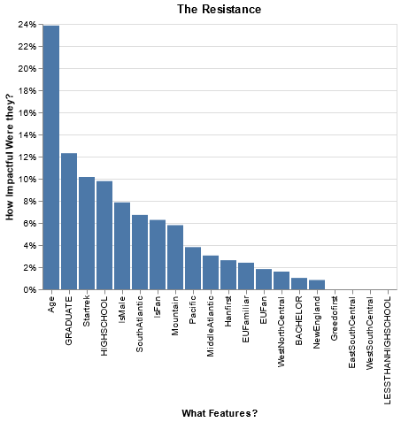
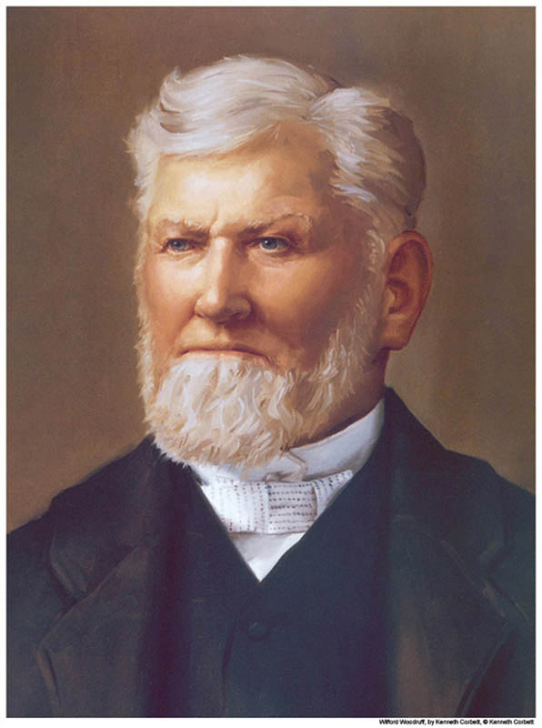

## Award-Winning Projects

1st Place, 2023 BYUI Data Science Hackathon

## Statistical Tests & Meaningful Explanations 
Projects from Math 325 & 425: Statistical Tests & Linear Regression. I scored 100% on both exams, and really started to connect my explanations to my analysis.
<table>
  <tr>
    <td></td>
    <td></td>
  </tr>
</table>

## Data Wrangling with R
Projects from DS 350: Data Wrangling and Visualization. GGplot, Tidyverse, spatial data, weather: all kinds!
<table>
  <tr>
    <td></td>
    <td></td>
  </tr>
</table>

## Python & Machine Learning
Projects from DS 250: Data Programming with Python. I scored a perfect grade in the class, and picked up Python pretty quickly after a 5-year break.

<table>
  <tr>
    <td></td>
    <td></td>
  </tr>
</table>

## Tableau

I've learned a lot since these projects, but these were my introduction to dashboards, interactivity, and visualization. I don't have the heart to remove them.

<table>
  <tr>
    <td></td>
    <td></td>
  </tr>
</table>

<!--

-->
